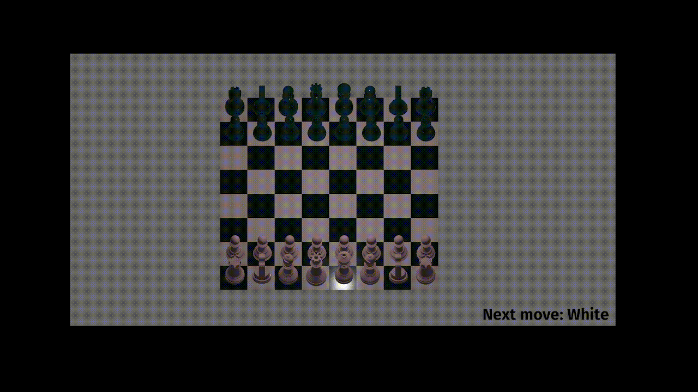

# Bevy Chess 

Fork of https://github.com/thmsgntz/rust-chess-3d updated to Bevy 0.10 and bevy_mod_picking 0.12, with bevy_tweening added.

Link to original tutorial (Bevy 0.4.0): https://caballerocoll.com/blog/bevy-chess-tutorial/ 

## License

Published under a [MIT License](/License.md). 
